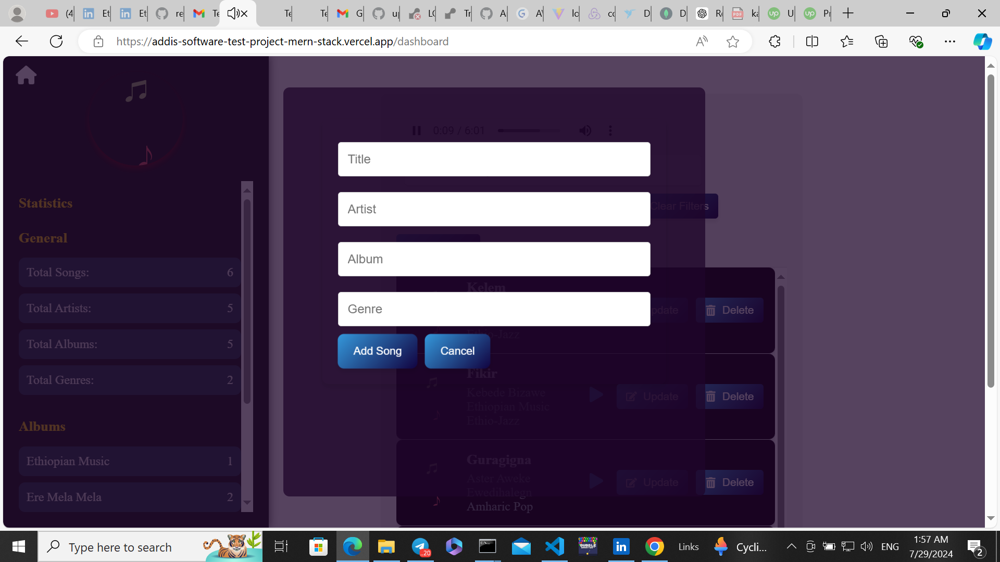
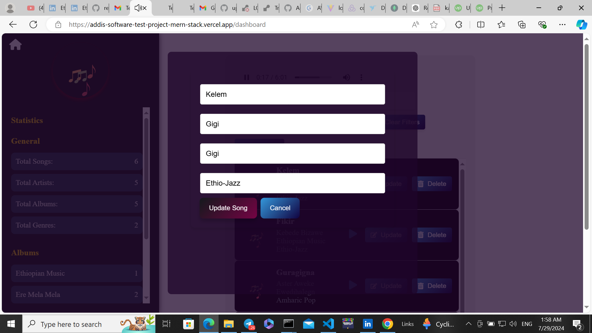
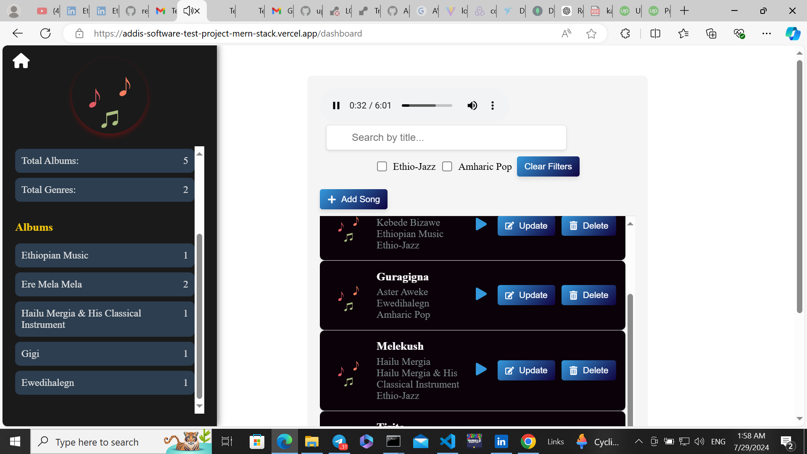
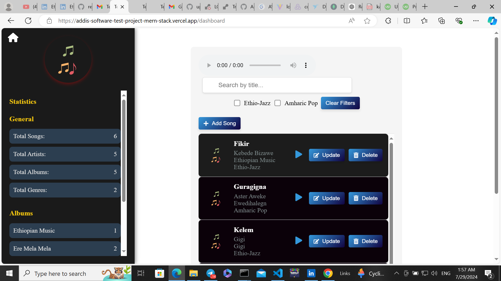
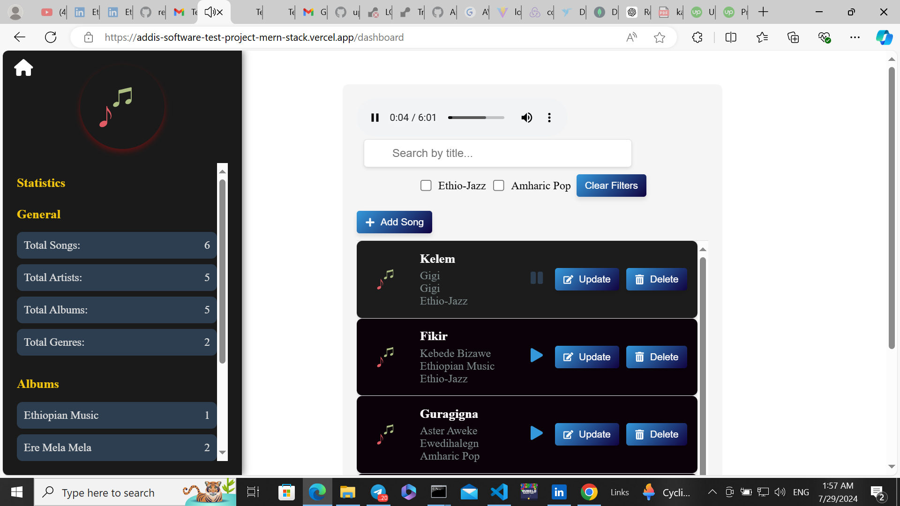

# MusicApp


This project serves as a test project for a position at Addis Software PLC, showcasing various modern technologies and best practices in both frontend and backend development.

## Features

- **Hero Section**: Engaging introduction with dynamic background transitions.
- **Test Project Button**: Provides access to the test project for Addis Software PLC.
- **Responsive Design**: Ensures compatibility across various devices and screen sizes.
- **TypeScript Integration**: Implements static type checking for improved code quality.
- **Dynamic Animations**: Includes animated effects for text and buttons.
- **Full Stack Integration**: Combines frontend and backend technologies for a complete solution.

## Technologies Used

### Frontend

- **React**: JavaScript library for building user interfaces.
- **TypeScript**: Superset of JavaScript for type safety.
- **Emotion**: CSS-in-JS library for component styling.
- **React Router DOM**: For client-side routing and navigation.
- **Vite**: Fast build tool for frontend development.

### Backend

- **Node.js**: JavaScript runtime for server-side logic.
- **Express**: Web application framework for Node.js.
- **MongoDB**: NoSQL database for storing user and music data.
- **Mongoose**: ODM (Object Data Modeling) library for MongoDB.
- **WebSocket**: For real-time data updates.


## API Endpoints

Here are the available backend API endpoints for interacting with the music data:

### Fetch Songs

- **Endpoint**: `GET /api/songs/songs`
- **Description**: Retrieves a list of all songs.
- **URL**: [https://test-project-wt7s.onrender.com/api/songs/songs](https://test-project-wt7s.onrender.com/api/songs/songs)
- **Example Request**:
    ```bash
    curl -X GET https://test-project-wt7s.onrender.com/api/songs/songs
    ```

### Create Song

- **Endpoint**: `POST /api/songs/create_songs`
- **Description**: Creates a new song entry.
- **URL**: [https://test-project-wt7s.onrender.com/api/songs/create_songs](https://test-project-wt7s.onrender.com/api/songs/create_songs)
- **Example Request**:
    ```bash
    curl -X POST https://test-project-wt7s.onrender.com/api/songs/create_songs -H "Content-Type: application/json" -d '{"title": "Song Title", "artist": "Artist Name", "album": "Album Name"}'
    ```

### Song Statistics

- **Endpoint**: `GET /api/songs/songs/songs/statistics`
- **Description**: Retrieves statistics related to songs.
- **URL**: [https://test-project-wt7s.onrender.com/api/songs/songs/statistics](https://test-project-wt7s.onrender.com/api/songs/songs/statistics)
- **Example Request**:
    ```bash
    curl -X GET https://test-project-wt7s.onrender.com/api/songs/songs/songs/statistics
    ```

## Installation

To set up the project locally, follow these steps:

### 1. Clone the Repository

```bash
git clone git@github.com:Ammen1/Test-Project.git
cd musicapp
```

### 2. Setup Backend

Navigate to the backend directory and install dependencies:

```bash
cd backend
npm install
# or
yarn install
```

Create a `.env` file in the `backend` directory and add your environment variables (e.g., database connection string).

### 3. Start Backend Server

```bash
npm run dev
# or
yarn run dev
```

The backend server will run on `http://localhost:5173` by default.

### 4. Setup Frontend

Navigate to the frontend directory and install dependencies:

```bash
cd ../frontend
npm install
# or
yarn install
```

### 5. Start Frontend Server

```bash
npm run dev
# or
yarn dev
```

The frontend application will be available at `http://localhost:5173`.

## Project Structure

### Frontend

- **`/src`**: Contains all source files.
  - **`/components`**: React components.
    - **`HomePage.tsx`**: Main page with hero section and call-to-action button.
  - **`/styles`**: Emotion CSS-in-JS styling.
    - **`style.ts`**: Shared styles.
    - **`stylehomepage.ts`**: Shared styles.
    - **`style.sidebar.ts`**: Shared styles.
  - **`/utils`**: Utility functions and types.
  - **`App.tsx`**: Main application component.
  - **`main.tsx`**: Entry point of the application.
- **`/public`**: Static assets.

### Backend

- **`/src`**: Contains backend source files.
  - **`/controllers`**: Business logic for handling requests.
  - **`/models`**: Mongoose models for MongoDB.
  - **`/routes`**: API routes.
  - **`/utils`**: Utility functions and middlewares.
  - **`app.js`**: Entry point for the backend server.
  - **`server.js`**: Entry point for the backend server.
- **`/config`**: Configuration files (e.g., environment variables).
- **`/public`**: Static assets.

## Key Features

### Hero Section

- Features a dynamic background with keyframe animations.
- Includes a button with a pulsing effect.

### Backend Integration

- **API Routes**: Provides endpoints for accessing and managing music data.

### Responsive Design

- Adaptable layout for various screen sizes using media queries.

### TypeScript Integration

- Utilized in both frontend and backend for improved type safety.

## Logic and Implementation

### Frontend

- **Hero Section**: Animated background transitions through keyframe animations.
- **Button Animation**: Pulsing and color transition effects on hover.

### Backend

- **API Logic**: Handles CRUD operations for music data.
- **Real-Time Updates**: WebSocket integration for live notifications.

## Test Project Details

This project is created as a test for Addis Software PLC. It demonstrates the following:

- **Frontend Development**: Utilizing React, TypeScript, and Emotion for a modern, responsive UI.
- **Backend Development**: Implementing Node.js, Express, and MongoDB for server-side functionality.
- **Integration**: Full stack integration showcasing how frontend and backend components interact.


## Acknowledgements

- **React**: For building dynamic UIs.
- **TypeScript**: For adding type safety.
- **Emotion**: For CSS-in-JS styling.
- **Node.js**: For server-side development.
- **Express**: For API routing.
- **MongoDB**: For database management.
- **Docker**: For containerizing the database..






